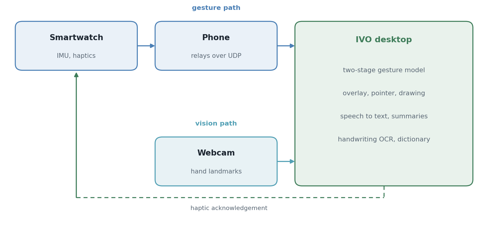

<div align="center">

# IVO: IMU-Vision Overlay

Yuhyeon Lee · 2025

[](https://github.com/blueion0612/IVO/actions/workflows/checks.yml)
[](LICENSE)
[](#requirements)
[](#limitations)
[](https://github.com/blueion0612/IVO/releases)

[**Architecture**](docs/architecture.md) · [**IMU input**](docs/imu-input.md) · [**Feature notes**](docs/features.md) · [**Pipeline notes**](docs/IVO_System_Pipeline_EN.md) · [**Related**](#related)

<picture>
  <source media="(prefers-color-scheme: dark)" srcset="docs/figures/hero_system-dark.png">
  
</picture>

</div>

*Two input paths into one desktop app. Green is the gesture path from the watch
through the phone, gold the vision path from the webcam. The dashed line is the
haptic acknowledgement sent back to the wrist.*

**IVO** drives a presentation without a clicker. A gesture on a smartwatch changes
the slide, and the watch buzzes back to confirm it was read. A webcam adds hand
tracking for pointing and drawing on top of whatever is on screen. Speech becomes
transcript and summary locally, and handwriting on the overlay becomes text, working
arithmetic and plotted graphs. Undergraduate capstone project, Myongji University,
2025.

## Features

| Feature | What it does | Built on |
|---|---|---|
| Gesture control | Fifteen wrist gestures change and jump slides, black out the screen and switch every other mode on and off. The watch vibrates when a gesture is read. | two-stage model trained with [IMU_Gesture_Classifier](https://github.com/blueion0612/IMU_Gesture_Classifier) |
| Hand tracking | The index finger is a pointer, a pinch draws, six colors and four line widths are picked by hovering, and a four-corner calibration maps the camera to the screen. | MediaPipe on the webcam |
| Handwriting OCR | Strokes drawn on the overlay become text, an evaluated arithmetic expression or a plotted graph. | Google Vision and SimpleTex APIs, SymPy, Matplotlib |
| Speech to text | A transcript of what is said, and a summary of the question-and-answer segments. | faster-whisper and an Ollama model, both running locally |
| Sticky notes | Voice-to-text notes with word lookups in Korean and English. | the National Institute of Korean Language Open API and the Free Dictionary API |
| Timer | An on-screen presentation timer, toggled by a gesture or a key. | the overlay |
| Device selection | Camera and microphone chosen by name, so a setup survives a reboot. | Electron |

Each of these is broken down in [the feature notes](docs/features.md). Every feature
is also reachable from the keyboard, so the app runs without any of the hardware.

## Quick start

Node.js 18 or newer and Python 3.9 or newer. For gesture control, a WearOS watch and
an Android phone running the [streaming app](https://github.com/blueion0612/IMU_Streamer),
on the same network as this machine.

```bash
git clone https://github.com/blueion0612/IVO.git
cd IVO
npm install
pip install torch mediapipe opencv-python numpy sympy matplotlib pillow requests websockets
```

Download `stage1_best.pt` and `stage2_best.pt` from the
[Google Drive folder](https://drive.google.com/drive/folders/1eac_bqIQ1vY2Z1D-OqNQRVsJi-RC-cR-?usp=drive_link)
into `models/`. They were trained with
[IMU_Gesture_Classifier](https://github.com/blueion0612/IMU_Gesture_Classifier); the
folder also holds the recordings, for training different ones. If the folder is
unavailable, the two files are sent on request by email (yuhyunkorea@gmail.com).

```bash
npm start              # launcher, then the overlay
npm run start:direct   # straight to the overlay
```

Three parts are optional and install separately: `pip install faster-whisper
sounddevice` for speech to text, which wants a CUDA GPU; [Ollama](https://ollama.com/download)
with `ollama pull gemma2:9b` for the summaries; and a `.env` file holding
`KOREAN_DICT_API_KEY`, from the
[National Institute of Korean Language Open API](https://opendict.korean.go.kr/service/openApiInfo),
for the Korean dictionary. English lookups need no key.

## Usage

IVO recognizes fifteen gestures:

| Gesture | Action | Description |
|---|---|---|
| **Left Swipe** | Previous Slide | Navigate to previous slide |
| **Right Swipe** | Next Slide | Navigate to next slide |
| **Up Swipe** | Pointer Mode | Activate laser pointer overlay |
| **Down Swipe** | STT Recording | Toggle speech-to-text recording |
| **Circle CW** | Recording Mode | Start STT recording session |
| **Circle CCW** | Sticky Note Mode | Toggle sticky note mode with voice input |
| **Double Left** | Jump -3 Slides | Skip back 3 slides |
| **Double Right** | Jump +3 Slides | Skip forward 3 slides |
| **X Motion** | Reset All | Disable all features and reset state |
| **Double Tap** | Hand Drawing | Toggle hand tracking drawing mode |
| **90° Left** | OCR Start | Begin OCR session for handwriting |
| **90° Right** | Toggle Draw/Pointer | Switch between drawing and pointer modes |
| **Figure 8** | Timer Toggle | Start/stop presentation timer |
| **Square** | Calibrate | 4-corner hand tracking calibration |
| **Triangle** | Blackout | Toggle screen blackout mode |

### Keyboard shortcuts

The function keys fire the same commands as the gestures, so everything can be
driven without a watch.

| Key | Gesture | Action |
|---|---|---|
| F1 | Left | Previous Slide |
| F2 | Right | Next Slide |
| F3 | Up | Pointer Mode ON |
| F4 | Down | STT Recording Toggle |
| F5 | Circle CW | Recording Mode |
| F6 | Circle CCW | Sticky Note Mode |
| F7 | Double Left | Jump -3 Slides |
| F8 | Double Right | Jump +3 Slides |
| F9 | X | Reset All |
| F10 | Double Tap | Hand Drawing Mode |
| F11 | Figure 8 | Timer Toggle |
| F12 | Triangle | Blackout Toggle |

| Key | Action |
|---|---|
| H | Start Hand Tracking |
| C | Calibrate Hand Tracking (clears saved calibration) |
| P | Toggle Pointer/Drawing Mode |
| M | Test Summary Generation |
| Escape, Ctrl+Q | Quit Application |
| Ctrl+Shift+1 | Gesture Detect UI Test |
| Ctrl+Shift+R | Restart Gesture Controller |

### Configuration

`config/config.json` holds the network addresses, the gesture thresholds and the
overlay defaults. The `gesture_to_command` section maps gestures to commands.

```json
{
  "imu": {
    "udp_ip": "192.168.0.48",
    "udp_port": 65000,
    "stage1_threshold": 0.5,
    "stage2_collection_sec": 2.5,
    "cooldown_sec": 2.0
  },
  "websocket": {
    "port": 17890
  },
  "overlay": {
    "default_color": "rgba(255, 0, 0, 0.8)",
    "line_width": 4,
    "hover_duration_ms": 700
  }
}
```

<details>
<summary><b>When something does not start</b></summary>

| Symptom | Check |
|---|---|
| Python not found | `where python` on Windows, `which python3` on macOS; the interpreter must be on `PATH` |
| WebSocket connection failed | the streaming app is running, and the phone and this machine are on the same network |
| Hand tracking does nothing | the webcam is connected and not held by another program, the lighting is even, then run the calibration with `C` or the Square gesture |

</details>

## Repository layout

```
src/
  main/                    Electron main process
    main.js                application entry point
    gesture-controller.js  manages the Python gesture process
    hand-tracking.js       manages the Python hand tracker
    stt-manager.js         speech-to-text subprocess
    summarizer-manager.js  summarizer subprocess
    vocab-manager.js       dictionary subprocess
    websocket-server.js    gesture data over WebSocket
    ocr-handlers.js        OCR, calculation and graph IPC handlers
    ppt-controller.js      PowerPoint and Keynote slide control
    timer.js               presentation timer
  preload/preload.js       Electron context bridge
  renderer/                overlay and launcher UI, styles, UI modules
py/
  gesture/                 two-stage IMU gesture recognition
  vision/                  MediaPipe hand tracking
  stt/                     Whisper server, summarizer and its server
  vocab/                   Korean and English dictionary server
  ocr/                     OCR engine and the OCR, calculator, math and graph CLIs
  test/                    IMU and speech-to-text console tests
models/                    the two gesture checkpoints, downloaded, not in git
config/config.json         application configuration
docs/                      architecture, IMU packet layout, feature notes, pipeline notes
docs/figures/              README figure, the script that draws it, figstyle.py
image/                     app icon and assets
package.json               npm scripts and the electron-builder configuration
```

## Requirements

| Part | Requirement |
|---|---|
| Computer | Windows 10 or 11, or macOS 10.14 or newer |
| Runtime | Node.js 18 or newer, Python 3.9 or newer |
| Python packages | torch, mediapipe, opencv-python, numpy, sympy, matplotlib, pillow, requests, websockets; faster-whisper and sounddevice for speech to text |
| Node packages | `ws` at run time; `electron`, `electron-builder` and `rcedit` to build |
| Smartwatch | a WearOS watch with inertial sensors, for gestures |
| Smartphone | an Android phone running the [streaming app](https://github.com/blueion0612/IMU_Streamer) |
| Webcam | any, for hand tracking |
| GPU | wanted by speech to text and the summarizer; both run on CPU, slowly |

<details>
<summary><b>Building installers</b></summary>

```bash
npm run build           # Windows, NSIS installer
npm run build:portable  # Windows, portable
npm run build:mac       # macOS, DMG
npm run dist            # Windows installer without publishing
npm run dist:mac        # macOS DMG without publishing
```

Output lands in `dist/`. The [Releases](https://github.com/blueion0612/IVO/releases)
page carries the built installers.

</details>

## Limitations

- **The models are trained on one wearer.** Gesture recognition has not been
  evaluated on anyone else's movements, and the two-stage detector's thresholds were
  tuned by hand.
- **UDP with no acknowledgement.** A dropped packet shortens the window the
  classifier sees, and nothing detects that.
- **The desktop app must be reachable from the phone**, which means the same local
  network and no client isolation on the access point.
- **Speech to text and summarization run locally**, so both want a GPU. On CPU they
  work but are not interactive.
- **Handwriting OCR calls two cloud APIs**, Google Vision and SimpleTex, so it needs
  a network connection and their keys.
- **Hand tracking needs the calibration step** whenever the camera or the screen
  moves.
- Windows and macOS only. Nothing here has been run on Linux.

## Related

- [IMU_Streamer](https://github.com/blueion0612/IMU_Streamer): the watch
  and phone apps that send the 30-float packet IVO reads.
- [IMU_Gesture_Classifier](https://github.com/blueion0612/IMU_Gesture_Classifier):
  trains the two checkpoints IVO loads. It records the upstream 55-float packet, so
  the six channels sit at different indices in each; IVO remaps them, and
  [`docs/imu-input.md`](docs/imu-input.md) records both layouts.
- [VOX](https://github.com/blueion0612/VOX): the sibling capstone,
  hand signals from the same streaming apps for a different purpose.

## License

MIT. See [LICENSE](LICENSE).
